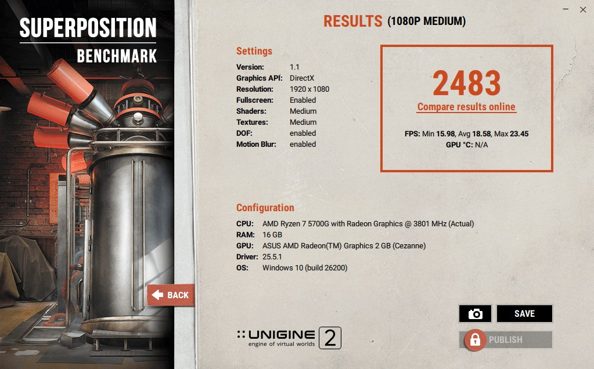

# RMA-001 - Bajones de FPS por memoria RAM en single channel

| Campo | Valor |
|-------|-------|
| **Código** | RMA-001 |
| **Categoría** | Caso RMA |
| **Área** | RMA, Taller de Armado, Soporte Técnico Virtual y Ventas |
| **Estado** | Validado |
| **Versión** | 1.0 |
| **Fecha de las pruebas** | 2026-07-15 |
| **Fecha de creación** | 2026-08-15 |
| **Última actualización** | 2026-08-15 |

---

# Resumen

Un cliente adquirió una PC para juegos basada en los gráficos integrados del procesador. Se había priorizado la ampliación futura mediante un único módulo DDR4 de 16 GB, pero el equipo presentaba bajos FPS y caídas de rendimiento en juegos.

Las pruebas comparativas mostraron que, manteniendo 16 GB de capacidad y DDR4-3200, el cambio de single channel a dual channel mejoró el puntaje de Superposition Benchmark entre **31,9 % y 48,9 %**, según los módulos utilizados.

No se detectó evidencia de una falla en el procesador o en los gráficos integrados. El rendimiento observado era consistente con una limitación de ancho de banda provocada por la configuración de memoria.

---

# Síntoma informado

- Bajos FPS y caídas de rendimiento durante juegos.
- Equipo destinado a gaming sin placa de video dedicada.
- Gráficos integrados dependientes de la memoria RAM del sistema.
- Configuración original de memoria: 1 × 16 GB DDR4-3200 en single channel.

---

# Configuración del equipo

| Componente | Configuración |
|------------|---------------|
| Procesador | AMD Ryzen 7 5700G con gráficos Radeon integrados |
| Motherboard | ASUS PRIME B550M-A AC |
| Memoria total | 16 GB DDR4-3200 en las tres pruebas |
| Gráficos | AMD Radeon Graphics integrada, 2 GB UMA informados por el benchmark |
| Controlador gráfico | 25.5.1 |
| Sistema operativo | Informado por Superposition como Windows 10, build 26200 |
| Benchmark | Unigine Superposition 1.1 |

Los datos de plataforma y memoria fueron verificados mediante reportes de CPU-Z 2.20.2.

---

# Hipótesis

La configuración de un único módulo limitaba el ancho de banda disponible para la GPU integrada. Al compartir la RAM del sistema como memoria gráfica, la iGPU resultaría especialmente afectada por el funcionamiento en single channel.

También se evaluó si la organización interna de los módulos —1Rx16 frente a 1Rx8— producía una diferencia adicional dentro de configuraciones dual channel equivalentes en capacidad, frecuencia y latencias primarias.

---

# Metodología

Se ejecutó Superposition Benchmark con la siguiente configuración:

| Parámetro | Valor |
|-----------|-------|
| Preset | 1080p Medium |
| API gráfica | DirectX |
| Resolución | 1920 × 1080 |
| Pantalla completa | Habilitada |
| Shaders | Medium |
| Texturas | Medium |
| Depth of Field | Habilitado |
| Motion Blur | Habilitado |

Se probaron tres configuraciones de memoria con 16 GB totales. CPU-Z confirmó que todas operaban aproximadamente a DDR4-3200, con latencias primarias `18-22-22-42` y Command Rate `1T`.

| Prueba | Módulos | Parte / modelo | Organización | Canales reportados |
|--------|---------|----------------|--------------|--------------------|
| A | 1 × 16 GB | Hiksemi Hiker `HKED4161CAB2F2HB1` | 2 ranks; ancho de dispositivo no registrado | 1 × 64 bits |
| B | 2 × 8 GB | Samsung `M378A1G44AB0-CWE` | 1Rx16 | 2 × 64 bits |
| C | 2 × 8 GB | Timetec `TIMETEC-U8G-3200` | 1Rx8, chips Micron | 2 × 64 bits |

---

# Resultados

| Prueba | Configuración | Puntaje | FPS mínimos | FPS promedio | FPS máximos | Mejora de puntaje frente a A |
|--------|---------------|--------:|------------:|-------------:|------------:|------------------------------:|
| A | 1 × 16 GB Hiksemi, single channel | 1882 | 11,90 | 14,08 | 18,37 | Base |
| B | 2 × 8 GB Samsung 1Rx16, dual channel | 2483 | 15,98 | 18,58 | 23,45 | +31,9 % |
| C | 2 × 8 GB Timetec 1Rx8, dual channel | 2803 | 17,96 | 20,97 | 25,99 | +48,9 % |

## Comparaciones

| Comparación | Puntaje | FPS mínimos | FPS promedio | FPS máximos |
|-------------|--------:|------------:|-------------:|------------:|
| Prueba B frente a A | +31,9 % | +34,3 % | +32,0 % | +27,7 % |
| Prueba C frente a A | +48,9 % | +50,9 % | +48,9 % | +41,5 % |
| Prueba C frente a B | +12,9 % | +12,4 % | +12,9 % | +10,8 % |

La mejora porcentual se calculó mediante:

`((resultado comparado ÷ resultado base) - 1) × 100`

---

# Evidencias

## Prueba A - 1 × 16 GB Hiksemi en single channel

## Prueba B - 2 × 8 GB Samsung 1Rx16 en dual channel

## Prueba C - 2 × 8 GB Timetec 1Rx8 en dual channel

Los reportes completos de CPU-Z utilizados para verificar la configuración contienen números de serie, UUID y otros identificadores del equipo. Por ese motivo no se incorporaron al repositorio; solamente se transcribieron los datos técnicos necesarios para reproducir y analizar el caso.

---

# Análisis

## Single channel frente a dual channel

Las pruebas B y C aumentaron el puntaje, los FPS mínimos, el promedio y los máximos frente a la prueba A. La mejora de los FPS mínimos fue de **34,3 %** con los módulos Samsung y de **50,9 %** con los módulos Timetec.

El resultado confirma que el ancho de banda de memoria era un factor limitante para los gráficos integrados del Ryzen 7 5700G. Los FPS mínimos también mejoraron, lo que coincide con la reducción de las caídas de rendimiento informadas por el cliente.

## Organización 1Rx16 frente a 1Rx8

Dentro de las configuraciones dual channel, el kit Timetec 1Rx8 obtuvo un puntaje **12,9 %** superior al kit Samsung 1Rx16 y una mejora similar en FPS promedio.

El resultado es consistente con un mejor desempeño de la organización 1Rx8 en esta plataforma y carga de trabajo. Sin embargo, debe considerarse evidencia indicativa y no una medición aislada del ancho de dispositivo: también cambiaron el fabricante de los módulos, los chips de memoria y posiblemente las latencias secundarias y terciarias.

---

# Diagnóstico

**Causa principal:** configuración de memoria en single channel, insuficiente para alimentar adecuadamente los gráficos integrados en una carga de gaming sensible al ancho de banda.

**Factor adicional observado:** el kit 1Rx8 rindió mejor que el kit 1Rx16 bajo las condiciones probadas.

**Clasificación:** limitación de configuración; no se determinó una falla física del procesador, la iGPU o la memoria original.

---

# Acción correctiva recomendada

- Utilizar dos módulos compatibles para habilitar dual channel.
- Para mantener 16 GB, priorizar un kit 2 × 8 GB y, cuando sea posible, módulos con organización 1Rx8.
- Si se requiere una ampliación cercana, evaluar 2 × 16 GB en lugar de entregar temporalmente el equipo con 1 × 16 GB.
- Verificar después del cambio que CPU-Z o la BIOS/UEFI informen dos canales activos y la frecuencia esperada.
- Ejecutar nuevamente el benchmark y una prueba de estabilidad de memoria.

La configuración finalmente entregada al cliente queda pendiente de registrar.

---

# Acción preventiva

## Ventas

- Consultar si el equipo utilizará gráficos integrados para juegos antes de definir la memoria.
- No priorizar la ampliación futura mediante un único módulo si esto compromete el uso principal informado por el cliente.
- Ofrecer 2 × 8 GB como base para 16 GB o 2 × 16 GB cuando se prevea una necesidad cercana de mayor capacidad.

## Taller de Armado

- Instalar los módulos en las ranuras recomendadas por el fabricante para dual channel.
- Verificar canales, frecuencia y capacidad durante el control final.
- Incluir una prueba gráfica cuando el equipo para gaming dependa de una iGPU.

## RMA y Soporte

- Revisar la configuración de canales ante reclamos de bajos FPS en equipos con gráficos integrados.
- Comparar los resultados con una configuración dual channel antes de asumir una falla de CPU o GPU.

---

# Limitaciones de la prueba

- Se conservó una captura final por configuración; no se registraron múltiples pasadas para calcular promedio y dispersión.
- Los kits dual channel pertenecen a fabricantes distintos y utilizan diferente organización de chips.
- Las latencias primarias fueron equivalentes, pero las latencias secundarias y terciarias no fueron controladas completamente.
- Los resultados corresponden a un Ryzen 7 5700G y a Superposition 1080p Medium; no deben generalizarse como un porcentaje universal.

Para fortalecer la comparación 1Rx16 frente a 1Rx8 se recomienda ejecutar al menos tres pasadas alternadas por configuración, reiniciar entre cambios y controlar temperatura, procesos en segundo plano, versión de BIOS y configuración UMA.

---

# Documentos relacionados

- [GUIDE-001 - Memoria RAM en dual channel](../02-Guias-Tecnicas/GUIDE-001-Memoria-RAM-Dual-Channel.md)

---

# Historial de cambios

| Versión | Fecha | Descripción |
|---------|-------|-------------|
| 1.0 | 2026-08-15 | Creación del caso a partir de pruebas internas realizadas el 2026-07-15. |
