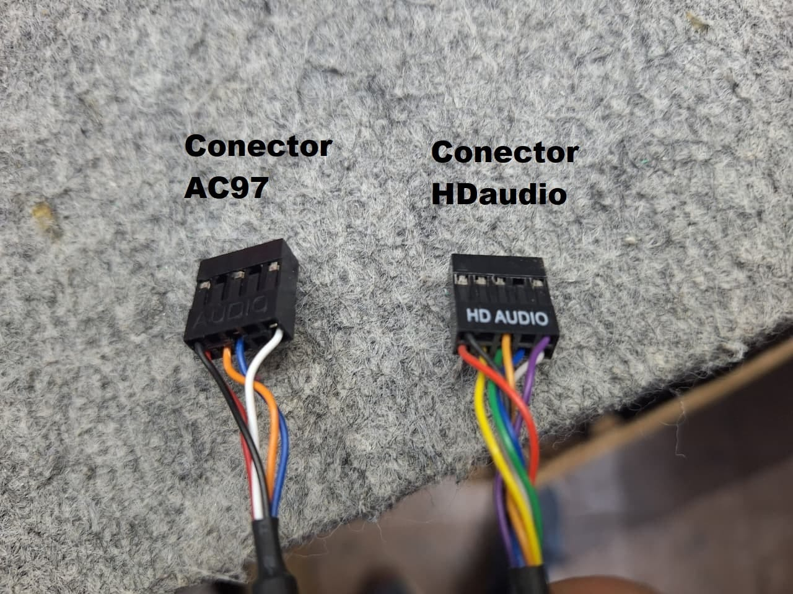

# COMP-002 - BIOSTAR H510MHP 4.0 con panel frontal AC'97

| Campo | Valor |
|-------|-------|
| **Código** | COMP-002 |
| **Categoría** | Compatibilidad / Incompatibilidad |
| **Área** | Ventas, Taller de Armado, RMA y Soporte Técnico Virtual |
| **Estado** | Vigente |
| **Versión** | 1.0 |
| **Fecha de creación** | 2026-08-15 |
| **Última actualización** | 2026-08-15 |

---

# Objetivo

Documentar la incompatibilidad observada entre el audio frontal de determinados gabinetes con cable **AC'97** y la motherboard **BIOSTAR H510MHP 4.0**, y establecer cómo identificar un gabinete adecuado antes de una venta o un armado.

---

# Componentes involucrados

## Motherboard

| Campo | Detalle |
|-------|---------|
| Código interno | 21032 |
| Modelo exacto | BIOSTAR H510MHP 4.0 |
| Audio integrado | Realtek ALC897, 7.1 canales, High Definition Audio |
| Conexión interna | Header para audio frontal |

La especificación oficial de BIOSTAR identifica el audio integrado como **High Definition Audio** y confirma la presencia de un header de audio frontal.

## Gabinetes relevados

Se encontraron cables frontales AC'97 en unidades de gabinetes económicos comercializados en combos o kits, entre ellos unidades identificadas internamente como:

- Performance Mate.
- Kelyx.

La marca o la condición de gabinete kit no determinan por sí solas el estándar. El cable debe revisarse físicamente porque el fabricante puede modificar el panel frontal entre modelos o lotes.

---

# Diferencia entre AC'97 y HD Audio

AC'97 es un estándar anterior de audio para PC. Intel HD Audio fue desarrollado como su reemplazo y añadió una arquitectura de audio más moderna, mayor capacidad y funciones como detección de conectores cuando el hardware las implementa.

En el panel frontal de un gabinete, ambos cables pueden utilizar una ficha de aspecto casi idéntico: dos filas de cinco posiciones con una posición bloqueada. Sin embargo, la asignación eléctrica de varias señales es diferente.

| Característica | AC'97 | HD Audio |
|----------------|-------|----------|
| Identificación habitual | `AC'97` o `AC97` | `HD AUDIO` |
| Estándar | Legado | Actual |
| Detección de conexión | No utiliza el esquema moderno de jack sensing | Puede utilizar señales de presencia y jack sensing |
| Cableado interno | Señales y retornos propios de AC'97 | Señales y retornos definidos para HD Audio |

*A la izquierda, el cable AC'97 relevado; a la derecha, un cable HD Audio. La similitud física no implica igualdad eléctrica.*

!!! warning "No conectar por similitud física"

    Que la ficha entre en el header no garantiza compatibilidad. No se deben mover pines, forzar conectores ni utilizar adaptaciones improvisadas.

---

# Compatibilidad

## Resultado documentado

| Combinación | Resultado |
|-------------|-----------|
| BIOSTAR H510MHP 4.0 + gabinete con cable `HD AUDIO` | Compatible y recomendada |
| BIOSTAR H510MHP 4.0 + unidades relevadas con cable únicamente `AC'97` | El panel frontal de audio no funciona correctamente; combinación no recomendada |
| BIOSTAR H510MHP 4.0 + audio del panel trasero | No depende del cable frontal del gabinete |

En las unidades relevadas, instalar los controladores correctos del sistema operativo no habilitó el panel frontal conectado mediante AC'97. El controlador puede administrar el codec, pero no modifica el cableado físico ni reasigna las señales del conector del gabinete.

Esta entrada registra una **incompatibilidad comprobada internamente**. La documentación pública de BIOSTAR consultada confirma el codec HD Audio y el header frontal, pero no presenta una matriz explícita de compatibilidad con paneles AC'97 para esta revisión.

---

# Síntomas esperables

- Los auriculares conectados al panel frontal no reproducen sonido.
- El micrófono frontal no es detectado o no recibe señal.
- El software de audio no detecta la inserción del conector.
- El audio trasero puede funcionar normalmente, lo que descarta una falla general del codec.

El problema puede confundirse con un controlador ausente, una configuración del sistema operativo o una falla del motherboard. Por eso debe verificarse primero la etiqueta del cable frontal.

---

# Verificación antes de una venta o un armado

1. Identificar el modelo exacto del gabinete.
2. Abrir el gabinete y localizar el cable del panel frontal de audio.
3. Confirmar que la ficha esté identificada como `HD AUDIO`.
4. Si el gabinete ofrece fichas `HD AUDIO` y `AC'97`, conectar únicamente `HD AUDIO` y dejar `AC'97` sin conectar.
5. Si sólo posee una ficha `AC'97`, elegir otro gabinete para utilizar con la BIOSTAR H510MHP 4.0.
6. Después del armado, probar auriculares y micrófono desde el panel frontal y verificar la detección en el sistema operativo.

!!! danger "No conectar ambas fichas"

    Cuando un gabinete incluye conectores `HD AUDIO` y `AC'97` sobre el mismo ramal, no se deben conectar ambos simultáneamente.

---

# Recomendaciones

## Para Ventas

- No combinar la BIOSTAR H510MHP 4.0 con una unidad de gabinete cuyo único conector frontal sea AC'97.
- Verificar el cable real del lote disponible en lugar de asumir compatibilidad por marca, precio o tipo de combo.
- Recomendar un gabinete con conector frontal identificado como `HD AUDIO`.

## Explicación sugerida para el cliente

> Este gabinete utiliza el estándar anterior AC'97 para el audio frontal, mientras que la configuración seleccionada requiere un panel frontal HD Audio. Aunque las fichas son físicamente parecidas, su cableado interno es diferente y el controlador de Windows no puede corregirlo. Para asegurar el funcionamiento de auriculares y micrófono frontales, corresponde utilizar un gabinete con cable HD Audio.

## Para Taller, RMA y Soporte

- Revisar la etiqueta del cable antes de reinstalar controladores o reemplazar componentes.
- Confirmar que el cable esté conectado al header de audio y no a un header USB de forma accidental.
- Probar por separado las salidas traseras y frontales para delimitar la falla.
- No modificar el pinout ni instalar adaptadores sin documentación y validación técnica.
- Registrar el modelo y lote del gabinete si se detectan cambios de cableado dentro de una misma línea comercial.

---

# Limitaciones

- La conclusión sobre Performance Mate y Kelyx corresponde a las unidades relevadas; otros modelos o lotes pueden incorporar HD Audio.
- La calidad final no depende únicamente del nombre del estándar: también intervienen el codec, el diseño del motherboard, el cableado, la interferencia y los auriculares o micrófonos utilizados.
- Una futura revisión de hardware, firmware o documentación de BIOSTAR puede requerir volver a validar esta entrada.

---

# Referencias

- [BIOSTAR - H510MHP 4.0](https://www.biostar.com.tw/app/en/mb/introduction.php?S_ID=1156&data-type=SPECIFICATIONS)
- [BIOSTAR - Especificaciones exportadas de H510MHP 4.0](https://www.biostar.com.tw/app/en/mb/export/spec_export.php?S_ID=1156)
- [Intel - Presentación de la especificación High Definition Audio](https://www.intel.com/pressroom/archive/releases/2004/20040415tech.htm)
- Prueba interna con la motherboard y los gabinetes indicados.

Referencias consultadas el **2026-08-15**.

---

# Evidencia interna

- [Fotografía comparativa de conectores AC'97 y HD Audio](../07-Imagenes/COMP-002/diferencia-conectores-ac97-hd-audio.jpeg)

---

# Historial de cambios

| Versión | Fecha | Descripción |
|---------|-------|-------------|
| 1.0 | 2026-08-15 | Creación del documento e incorporación de evidencia fotográfica. |
